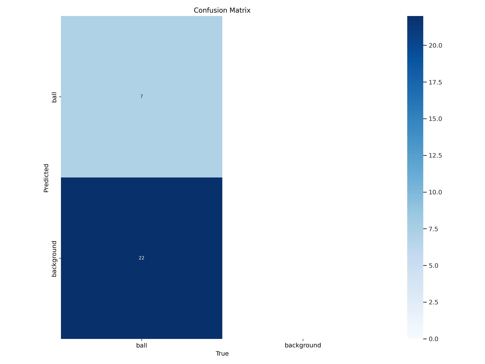
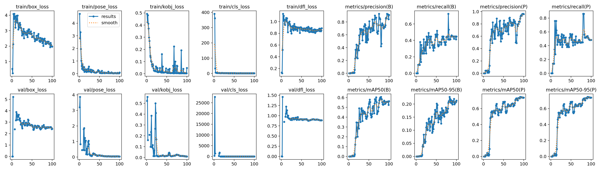

# Padel keypoints detection YOLOV8

Training and validation with yolov8 with the [padel ball roboflow](https://universe.roboflow.com/university-xib5d/padel-ball-qtcqs/dataset/1) dataset (keypoint labeling) with tranfer learning with pose estimation.

-----
Video dataset from : [video padel youtube](https://www.youtube.com/watch?v=P6yfa7rfc6o)

Video Final ball detection : [output_video](README-images/output_video.mp4)
#### Validation Results

  

#### Confusion Matrix

  

#### Results

  

